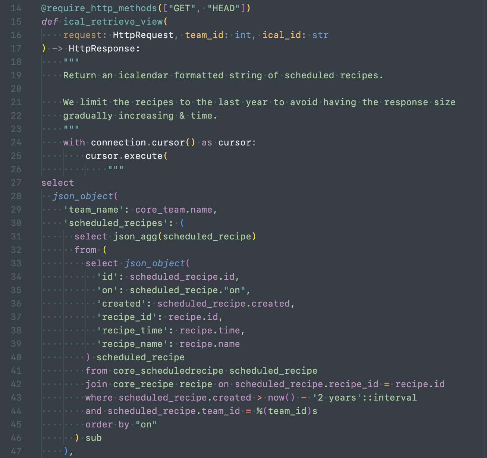

# python-inline-sql-syntax

Add SQL syntax highlighting for Python strings.

## Features

### Syntax highlighting for mutli-line strings



## Development

### VSCode instructions

#### Get up and running straight away

- Press `F5` to open a new window with your extension loaded.

#### Make changes

- You can relaunch the extension from the debug toolbar after changing code in `src/extension.ts`.
- You can also reload (`Ctrl+R` or `Cmd+R` on Mac) the VS Code window with your extension to load your changes.

### Publish

```bash
vsce package
vsce login chdsbd
vsce publish <version>
```

[marketplace]: https://marketplace.visualstudio.com/items?itemName=chdsbd.python-inline-sql-syntax
